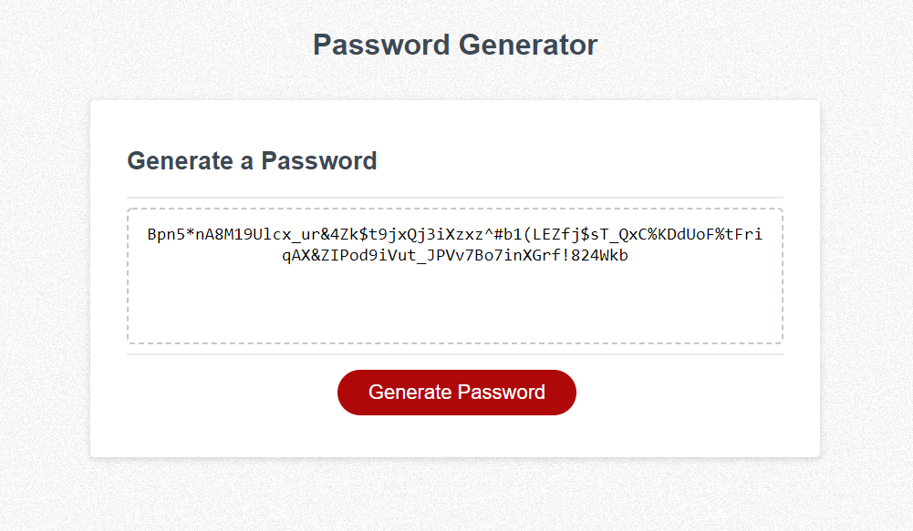

## Table of Contents 

  * [Description](#description)

  * [Screenshots](#screenshots)

  * [Live Link](#live-link)

  * [License](#license)

  ## Description

  This in-browser password generator let's you generate a strong password that provides greater security for your account. This generator lets you adjust multiple criterias based on your needs, inlcuding password length, special characters, numbers, and upper and lowercase letters.

  ## Screenshots

  

  ## Live Link

